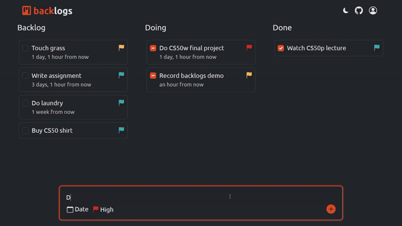

<div align="center">

# backlogs

**Yet another kanban to-do list with a natural language input parser**



</div>

## About

Backlogs is a to-do list app that helps you manage tasks efficiently with a
kanban layout. It automatically extracts deadlines and priorities from natural
language input, making it easy to create tasks and stay on track to finish them
on time.

### Features

- **Natural language parser:** create tasks using intuitive natural language
  inputs by identifying date phrases and priority keywords.
- **Responsive kanban board:** drag-and-drop tasks across different status
  columns (e.g., To Do, In Progress, Done). And yes, the layout also adapts to
  various screen sizes.
- **Task prioritization:** categorize tasks by priority levels such as Low,
  Medium, and High.
- **Authentication:** register, log in, and manage a personal backlog of tasks.

## Usage

1. Sign up or sign in to manage your tasks.
2. Add a new task by clicking the input field and typing your task title (try
   adding a task with a due date and priority). Here's a good one:
   `finish project next monday at noon !high`
3. Drag and drop tasks to change their status.
4. Click a task to update its details, save changes, or delete it.
5. Sign out, if you want to (I don't).

## Dev Setup

1. Clone the repo
   ```sh
   git clone https://github.com/andrianllmm/backlogs.git
   cd backlogs
   ```
2. Create and activate a virtual environment
   ```sh
   python -m venv env
   source venv/bin/activate  # or venv\Scripts\activate for Windows
   ```
3. Install the dependencies
   ```sh
   pip install -r requirements.txt
   ```
4. Run the development server
   ```sh
   python manage.py runserver
   ```

## Contributing

Contributions are welcome! To get started:

1. Fork the project
2. Create your feature branch (`git checkout -b feature/AmazingFeature`)
3. Commit your changes (`git commit -m 'Add some AmazingFeature'`)
4. Push to the branch (`git push origin feature/AmazingFeature`)
5. Open a pull request

## Issues

Found a bug or issue? Report it on the
[issues page](https://github.com/andrianllmm/backlogs/issues).
