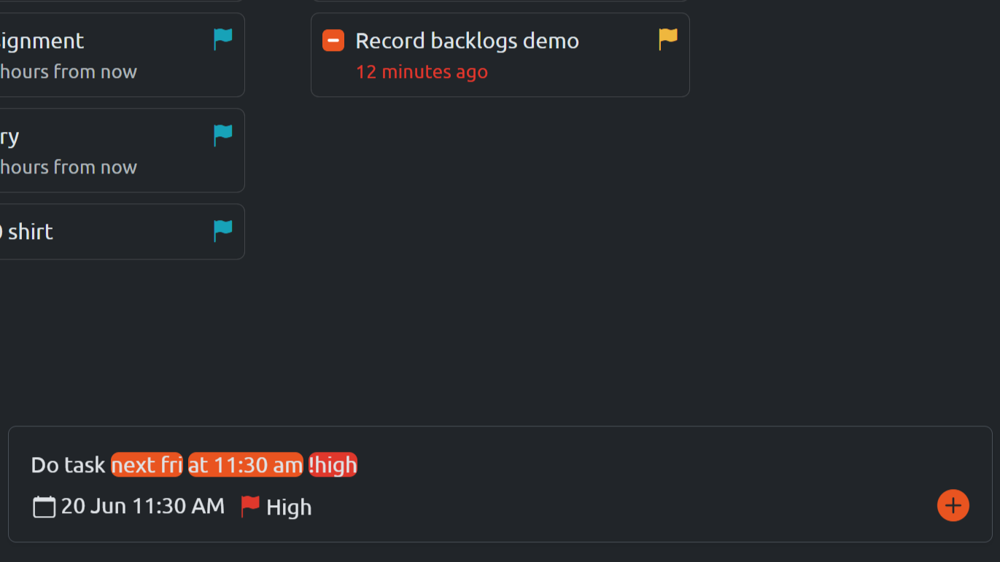
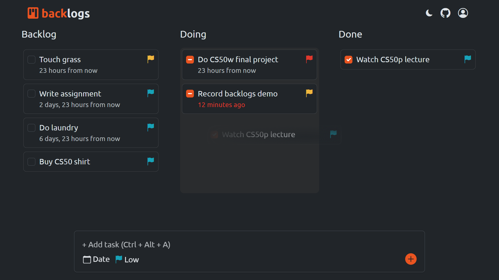
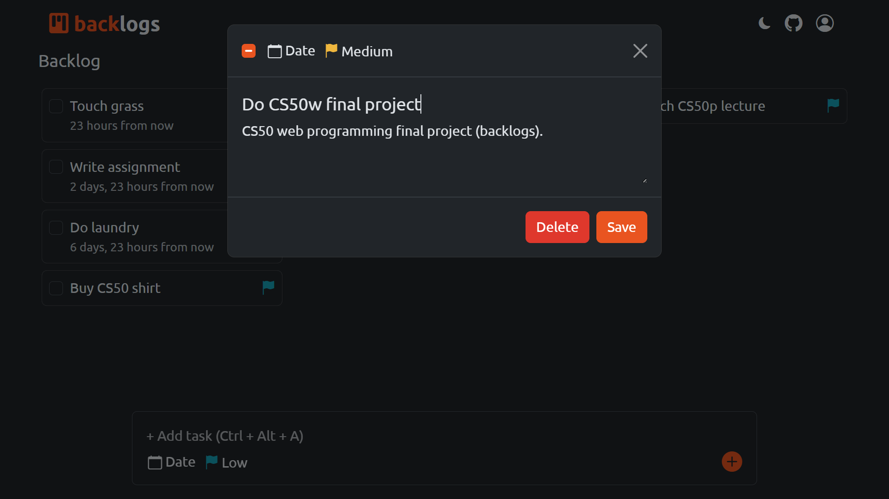

# backlogs
#### Video Demo: https://youtu.be/utEiUOPAhuA?si=Th_47tnXj3tPsmBR
#### Description: A kanban to-do list with a natural language input parser.

<div align="center">
  
</div>

## About

**Backlogs** is a to-do list app (yes, another to-do list) that helps you manage tasks efficiently with a kanban layout. It automatically extracts deadlines and priorities from natural language input, making it easy to create tasks and stay on track to finish them on time.  Notably, both the kanban functionality and the natural language parser are built entirely from scratch (without relying on third-party libraries) demonstrating a deep understanding of core web technologies.


## Features

- **Responsive Kanban Board:** users can drag-and-drop tasks that lets them manage tasks across different status columns (e.g., To Do, In Progress, Done). And yes, the layout also adapts fluidly to various screen sizes using responsive design techniques such as transitioning from a 3 column layout to 1 column with 3 tabs, ensuring usability on smartphones, tablets, and desktops.
- **Natural Language Parser:** users can create tasks using intuitive natural language inputs like “Finish report by Friday, high priority.” The parser identifies temporal phrases and priority keywords, automatically assigning appropriate due dates and urgency levels.
- **Task Prioritization:** users can categorize tasks by priority levels such as Low, Medium, High, and Critical. Priorities influence visual indicators within the kanban columns, helping users quickly assess which tasks require immediate attention.
- **User Authentication:** users can register, log in, and manage their personal backlog of tasks. Built using Django’s built-in authentication system.


## Distinctiveness and Complexity

This project leverages many of the core lessons from [CS50's Web Programming](https://cs50.harvard.edu/web/2020/) course, including Django, JavaScript, Bootstrap, AJAX, and UI/UX principles. The project exceeds in complexity through the implementation of the following advanced features. First, I implemented the kanban board with custom drag-and-drop task movement using native HTML5 APIs and JavaScript event handling. Second, I implemented a rule-Based natural language parser that allows users to enter phrases, highlights keywords, and automatically converts them into structured task data such as dates, showcasing text processing and advanced CSS capabilities. Task creation and updates are also processed via AJAX, enabling asynchronous interactions without full-page reloads. Additionally, Django’s template system is heavily utilized to create reusable frontend components, particularly the `` feature, improving scalability and reducing code duplication. All of these are implemented without external libraries except Django and Bootstrap, emphasizing a strong grasp of the underlying technologies rather than reliance on pre-built tools.

While the concept of a to-do list app is common, the implementation of a kanban board with real-time updates, combined with natural language parser to process semantic dates and priorities from text, makes this project unique and challenging. Unlike the course’s other projects—such as Search, Wiki, Commerce, Mail, and Network, there is no to-do list app, and this project brings a fresh take by integrating these advanced features without using any third-party libraries.


## Usage

1. Sign up or sign in to manage your tasks.
2. Add a new task by clicking the input field and typing your task title (try adding a task with a due date and priority) Here's a good one: `Finish project next monday at noon !high`
3. Drag and drop tasks to change their status.
4. Click a task to update details and save changes.
5. Click a task to delete.
6. Sign out, if you want to.


## Examples





## File Structure

```
backlogs/
├── backlogs/            # Django project settings and configurations
├── todolist/
│   ├── models.py        # Task model with relevant fields
│   ├── views.py         # Task views and API endpoints
│   ├── forms.py         # Add and update tasks forms
├── users/
│   ├── models.py        # Custom user model (make email the username)
│   ├── views.py         # User-related views (login, register)
│   ├── forms.py         # User registration and login forms
├── templates/
│   ├── layout.html      # Common layout for all pages
│   ├── components/      # Reusable frontend components
├── static/
│   ├── css/             # Stylesheets
│   ├── js/              # JavaScript modules
│   │   ├── kanban/      # Drag-and-drop functionality
│   │   ├── inputParser/ # Natural language input parser
│   │   ├── main.js      # Main JS file (includes all modules)
├── manage.py
└── requirements.txt     # Python dependencies
```


## Development

### Tech Stack

- **Python**
- **Django**: A high-level Python web framework.
- **JavaScript**: A programming language that adds interactivity to web pages.
- **AJAX**: Asynchronous JavaScript and XML.
- **CSS**: Cascading Style Sheets.
- **Bootstrap**: A CSS framework for responsive, mobile-first web development.
- **HTML**: Hypertext Markup Language.

### Setup

1. Clone the repository:

```bash
git clone https://github.com/andrianllmm/backlogs.git
cd backlogs
```

2. Create and activate a virtual environment:

```bash
python -m venv env

# Linux/macOS:
source venv/bin/activate
# Windows:
venv\Scripts\activate
```

3. Install dependencies:

```bash
pip install -r requirements.txt
```

4. Start the development server:

```bash
python manage.py runserver
```

5. Open the application in your browser:

```bash
http://localhost:8000/
``